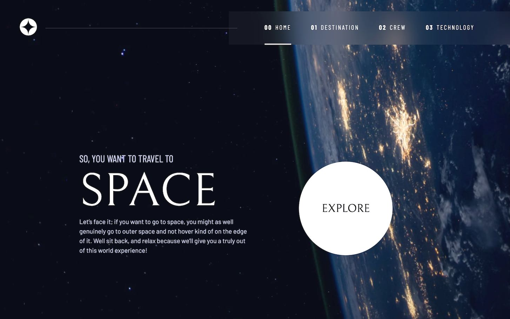

# Frontend Mentor - Space tourism website solution

This is a solution to the [Space tourism website challenge on Frontend Mentor](https://www.frontendmentor.io/challenges/space-tourism-multipage-website-gRWj1URZ3). Frontend Mentor challenges help you improve your coding skills by building realistic projects.

## Table of contents

- [Overview](#overview)
  - [The challenge](#the-challenge)
  - [Screenshot](#screenshot)
  - [Links](#links)
- [My process](#my-process)
  - [Built with](#built-with)
  - [What I learned](#what-i-learned)
- [Author](#author)

## Overview

### The challenge

Users should be able to:

- View the optimal layout for each of the website's pages depending on their device's screen size
- See hover states for all interactive elements on the page
- View each page and be able to toggle between the tabs to see new information

### Screenshot

### Links

- Solution URL: [GitHub](https://github.com/davidbdeath/space-tourism-website)
- Live Site URL: [Space Tourism Site](https://davidbdeath.github.io/space-tourism-website/)

## My process

I approached implementing this site using Javascript to toggle content visibility instead of creating a new HTML document for sub-page content. The content change controls for each page are done using the ARIA tablist. As a result, the page is screen reader-friendly.

### Built with

- Semantic HTML5 markup
- CSS custom properties
- CSS Flexbox
- CSS Grid
- Mobile-first workflow

### What I learned

I learn CSS Grid and expanded my knowledge of Aria for accessibility.

## Author

- Website - [David Dyer](https://www.daviddyer.me/)
- Frontend Mentor - [@davidbdeath](https://www.frontendmentor.io/profile/davidbdeath)
